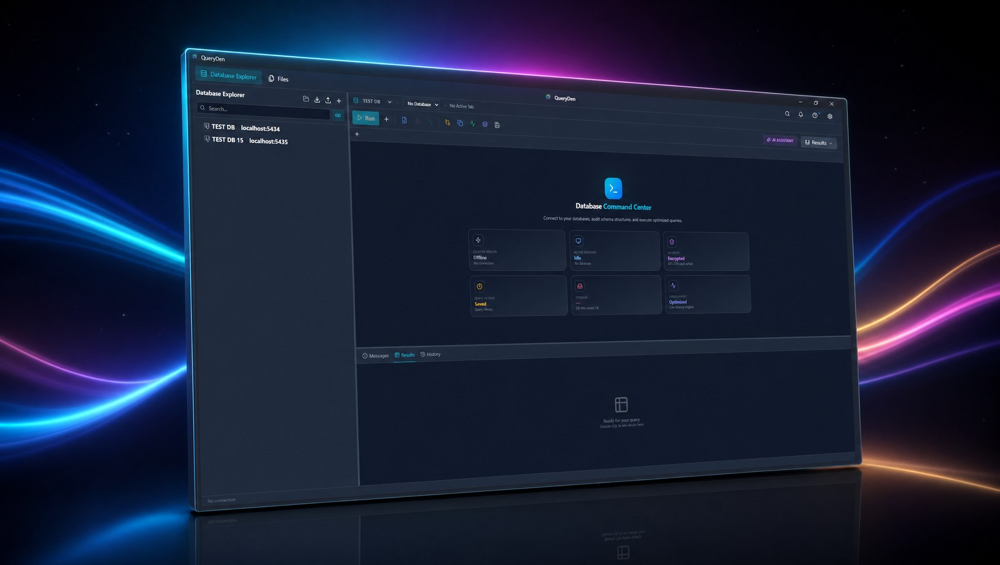

<div align="center">



# QueryDen

**The database manager that isn't an Electron app.**

A native, open-source SQL client for Postgres, MySQL, SQLite, CockroachDB and Supabase.
Built in Rust. ~11 MB installer. Zero telemetry.

[](LICENSE)
[](https://github.com/openidle-dev/queryden/releases/latest)
[](https://github.com/openidle-dev/queryden/actions/workflows/ci.yml)
[](https://github.com/openidle-dev/queryden/releases)
[](https://github.com/openidle-dev/queryden/stargazers)


[**Download**](https://github.com/openidle-dev/queryden/releases/latest) ·
[**Documentation**](https://queryden.openidle.com/docs) ·
[**Website**](https://queryden.openidle.com) ·
[**Changelog**](https://queryden.openidle.com/changelog) ·
[**Roadmap**](https://queryden.openidle.com/roadmap)

</div>

---

## Why QueryDen

A database manager should be a database manager — not a 250 MB Java IDE, not a 200 MB Chromium bundle pretending to be an app. QueryDen is a native desktop client built on Tauri + Rust, with a Monaco-powered SQL editor, a real schema explorer, an encrypted machine-locked vault, and an integrated `psql` console. MIT-licensed. No accounts. No telemetry.

## Install

Pre-built binaries for the latest release:

| Platform | Format |
|----------|--------|
| **Windows** | [`.exe` installer (NSIS)](https://github.com/openidle-dev/queryden/releases/latest) |
| **macOS** (Apple Silicon) | [`.dmg`](https://github.com/openidle-dev/queryden/releases/latest) — universal build tracked in [#7](https://github.com/openidle-dev/queryden/issues/7) |
| **Linux** | [`.deb`](https://github.com/openidle-dev/queryden/releases/latest) or [`.AppImage`](https://github.com/openidle-dev/queryden/releases/latest) |

Or build from source — see [Building](#building) below.

## Features

| | |
|---|---|
| **Multi-engine** | Postgres · MySQL · MariaDB · SQLite · CockroachDB · Supabase |
| **SQL editor** | Monaco-powered with autocomplete, syntax highlighting, FK-aware JOIN suggestions, intention actions (Alt+Enter), and live templates |
| **Schema explorer** | Tree-view browser for schemas, tables, columns, indexes, triggers, and foreign keys |
| **Visual EXPLAIN** | EXPLAIN ANALYZE visualization for query performance tuning |
| **Encrypted vault** | Credential profiles with AES-256-GCM, Argon2id KDF, machine-locked storage, and 5-attempt brute-force lockout |
| **Local history** | Automatic file-change tracking with encrypted storage, diff view, and one-click revert |
| **Saved queries** | Per-connection query library with full execution history (timing, row counts) |
| **Backup & restore** | SQL dump and JSON backup/restore for whole databases |
| **psql console** | Integrated PostgreSQL CLI terminal with tabular output rendering |
| **SSH tunnels** | Connect through bastion hosts with password or key-based auth |
| **AI assistant** *(optional)* | BYO key for OpenAI, Anthropic, Google, or a local Ollama instance — off by default |
| **Keyboard-first** | Full keyboard navigation with customizable keymaps |

See the full feature reference at [queryden.openidle.com/docs](https://queryden.openidle.com/docs).

## Security & privacy

- **AES-256-GCM** for every sensitive file, with **Argon2id** key derivation combining vault password + machine ID + master key.
- **Machine-locked** — credential files refuse to load on a different computer.
- **OS keyring** (Keychain / Credential Manager / libsecret) for master key storage, with a local-file fallback.
- **Brute-force protection** — vault locks for a cooldown window after 5 failed attempts.
- **Signed updates** — every release ships SHA256 checksums; the updater refuses to install a tampered asset.
- **Zero telemetry.** QueryDen ships no analytics, no crash reports, no phone-home of any kind.
- The optional AI assistant talks directly from your machine to your chosen provider — no QueryDen server sits in the middle.

Full details: [queryden.openidle.com/security](https://queryden.openidle.com/security) · Vulnerability disclosure: [SECURITY.md](SECURITY.md).

## Documentation

The full reference — install, vault setup, the editor, every engine, the AI integration, security internals, and troubleshooting — lives at **<https://queryden.openidle.com/docs>**.

Docs are MDX files in [`website/src/content/docs/`](website/src/content/docs/). Every page has an "Edit on GitHub" link in its header.

## Contributing

Pull requests are welcome. See [CONTRIBUTING.md](CONTRIBUTING.md) for the development setup, coding conventions, and PR checklist. By participating you agree to abide by the [Code of Conduct](CODE_OF_CONDUCT.md).

- Found a bug? Open an [issue](https://github.com/openidle-dev/queryden/issues/new/choose).
- Spot a typo in the docs? The "Edit on GitHub" button on any [docs page](https://queryden.openidle.com/docs) takes you straight to the file.
- Want to discuss something larger? Start a [discussion](https://github.com/openidle-dev/queryden/discussions).

## Building

### Prerequisites

- [Node.js](https://nodejs.org/) 18+ (npm or pnpm)
- [Rust](https://rustup.rs/) 1.70+
- Build essentials (gcc, make, etc.)

### Steps

```bash
git clone https://github.com/openidle-dev/queryden.git
cd queryden
npm install
npm run tauri dev      # development
npm run tauri build    # production binaries
```

Output lands in `src-tauri/target/release/bundle/`. Cross-compiling to Windows from Linux: see [BUILD_WINDOWS.md](BUILD_WINDOWS.md).

<details>
<summary><strong>Project structure</strong></summary>

```
queryden/
├── src/                          # React + TypeScript frontend
│   ├── components/               # UI components (editor, explorer, results, tools)
│   ├── contexts/                 # React contexts (connections, theme)
│   ├── store/                    # Zustand stores
│   └── utils/                    # SQL formatting, security checks
├── src-tauri/                    # Rust backend
│   ├── src/
│   │   ├── cli.rs                # External CLI management (psql, mysql, ...)
│   │   ├── ssh.rs                # SSH tunnel lifecycle
│   │   ├── storage.rs            # Encrypted file storage
│   │   └── sysinfo.rs            # System info
│   └── patches/tauri-plugin-sql/ # Extended SQL plugin (arrays, intervals, ...)
├── website/                      # Astro marketing site + MDX documentation
└── package.json
```

</details>

## License

MIT — see [LICENSE](LICENSE).

## Acknowledgments

- [Tauri](https://tauri.app/) — Cross-platform desktop framework
- [Monaco Editor](https://microsoft.github.io/monaco-editor/) — Code editor
- [Glide Data Grid](https://glideapps.github.io/glide-data-grid/) — High-performance data grid
- [Zustand](https://zustand-demo.pmnd.rs/) — State management
- [ssh2](https://crates.io/crates/ssh2) — SSH tunneling (Rust)
