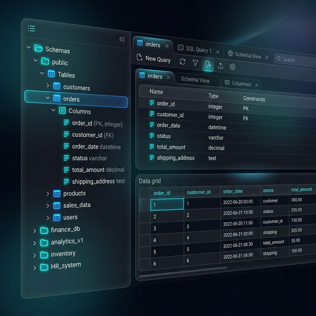

# QueryDen

A modern, cross-platform database manager built with Tauri, React, and TypeScript. Lightweight, fast, and secure — designed for developers who need a reliable database tool without the bloat.




## Features

- **Multi-Database Support** — PostgreSQL, MySQL, MariaDB, SQLite, CockroachDB, and Supabase
- **SSH Tunneling** — Connect to databases through SSH bastion hosts with password or key-based authentication
- **Intelligent SQL Editor** — Monaco-powered editor with autocomplete, syntax highlighting, JOIN suggestions via foreign keys, and intention actions (Alt+Enter)
- **Schema Explorer** — Tree-view database browser with schema selection, table details, columns, indexes, triggers, and foreign keys
- **Visual Query Optimizer** — EXPLAIN ANALYZE visualization for query performance tuning
- **Credential Vault** — Encrypted credential profiles with machine-locked AES-256-GCM encryption and Argon2id key derivation
- **Local History** — Automatic file change tracking with encrypted storage, diff view, and revert capability
- **Saved Queries** — Persistent query library with per-connection organization
- **Query History** — Full execution history with timing and row counts
- **Backup & Restore** — SQL dump and JSON backup/restore for databases
- **psql Console** — Integrated PostgreSQL CLI terminal with tabular output rendering
- **Connection Grouping** — Organize connections by database type in the explorer
- **Keyboard Shortcuts** — Full keyboard navigation with customizable keymaps
- **Live Templates** — SQL snippet templates for rapid query writing
- **AI Integration** — Optional AI-powered SQL assistance (OpenAI, Anthropic, Google, Ollama)

## Installation

### Pre-built Binaries

Download the latest release from the [Releases](https://github.com/openidle-dev/queryden/releases) page:
- **Linux**: `.deb` or `.AppImage`
- **Windows**: `.exe` installer (NSIS)
- **macOS (Apple Silicon)**: `.dmg` — a universal build covering Intel Macs is tracked in [#7](https://github.com/openidle-dev/queryden/issues/7); for now Intel users can build from source.

### Build from Source

#### Prerequisites

- [Node.js](https://nodejs.org/) 18+ (with npm or pnpm)
- [Rust](https://rustup.rs/) 1.70+
- Build essentials (gcc, make, etc.)

#### Steps

```bash
# Clone the repository
git clone https://github.com/openidle-dev/queryden.git
cd queryden

# Install frontend dependencies
npm install
# or: pnpm install

# Run in development mode (opens Tauri dev window)
npm run tauri dev

# Build for production
npm run tauri build
```

The built binaries will be in `src-tauri/target/release/bundle/`.

#### Cross-compile for Windows from Linux

```bash
npm run build:windows
```

## Data Storage

QueryDen stores data securely:

| Data Type | Storage | Encryption |
|-----------|---------|------------|
| Connections | `~/.local/share/com.queryden.app/connections.json` | AES-256-GCM (machine-locked) |
| Vault Credentials | `~/.local/share/com.queryden.app/vault.json` | AES-256-GCM (machine-locked) |
| Query History | `~/.local/share/com.queryden.app/query-history.json` | AES-256-GCM |
| Saved Queries | `~/.local/share/com.queryden.app/saved-queries.json` | AES-256-GCM |
| Local History | `~/.local/share/com.queryden.app/local-history.json` | AES-256-GCM |
| Settings | `~/.local/share/com.queryden.app/settings.json` | Plaintext |

Data is machine-locked using `/etc/machine-id` (Linux), BIOS UUID (Windows), or IOPlatformUUID (macOS). Connection files cannot be loaded on a different computer.

## Security

- **AES-256-GCM** encryption for all sensitive data
- **Argon2id** key derivation combining vault password + machine ID + master key
- **OS Keyring** integration for master key storage (with file fallback)
- **Machine-locked** storage — refuses to load on unauthorized machines
- **Brute-force protection** — vault locks after 5 failed attempts
- **No telemetry** — QueryDen collects zero usage data
- **Parameterized queries** — all SQL execution uses prepared statements
- **Signed updates** — every release ships SHA256 checksums; the in-app updater refuses to install an asset whose digest doesn't match

To report a vulnerability, see [SECURITY.md](SECURITY.md).

## Privacy & the AI assistant

QueryDen itself sends no analytics, no crash reports, and no telemetry. If you enable the **optional AI assistant** in settings, the following data leaves your machine and is sent directly from the app to the provider you configure (OpenAI, Anthropic, Google, or a local Ollama instance):

- Your prompt and any selected SQL / EXPLAIN output
- A short system prompt describing the task
- Your API key, in the `Authorization` / `x-api-key` header

QueryDen has no server in the middle — requests go straight from the desktop app to the provider's API. Your provider's data-retention policy applies. The AI assistant is **off by default** and can be disabled at any time from Settings → AI.

## Contributing

Pull requests are welcome. See [CONTRIBUTING.md](CONTRIBUTING.md) for the development setup, coding conventions, and PR checklist. By participating you agree to abide by the [Code of Conduct](CODE_OF_CONDUCT.md).

- Found a bug? Open an [issue](https://github.com/openidle-dev/queryden/issues/new/choose).
- Want to discuss something larger? Start a [discussion](https://github.com/openidle-dev/queryden/discussions).

## Project Structure

```
queryden/
├── src/                          # React frontend
│   ├── components/               # UI components
│   │   ├── editor/               # SQL editor (Monaco)
│   │   ├── explorer/             # Database tree explorer
│   │   ├── layout/               # Main layout panels
│   │   ├── results/              # Query results grid
│   │   ├── settings/             # Settings dialog
│   │   └── ui/                   # Shared UI components
│   ├── contexts/                 # React contexts (connections)
│   ├── store/                    # Zustand stores
│   └── utils/                    # Helper utilities
├── src-tauri/                    # Rust backend
│   ├── src/
│   │   ├── cli.rs                # CLI tool management (psql, mysql, etc.)
│   │   ├── ssh.rs                # SSH tunnel management
│   │   ├── storage.rs            # Encrypted file storage
│   │   └── sysinfo.rs            # System info & updates
│   └── patches/                  # Patched dependencies
│       └── tauri-plugin-sql/     # Extended SQL plugin (arrays, intervals, etc.)
└── package.json
```

## License

This project is licensed under the MIT License — see the [LICENSE](LICENSE) file for details.

## Acknowledgments

- [Tauri](https://tauri.app/) — Cross-platform desktop framework
- [Monaco Editor](https://microsoft.github.io/monaco-editor/) — Code editor
- [Glide Data Grid](https://glideapps.github.io/glide-data-grid/) — High-performance data grid
- [Zustand](https://zustand-demo.pmnd.rs/) — State management
- [ssh2](https://crates.io/crates/ssh2) — SSH tunneling (Rust)
